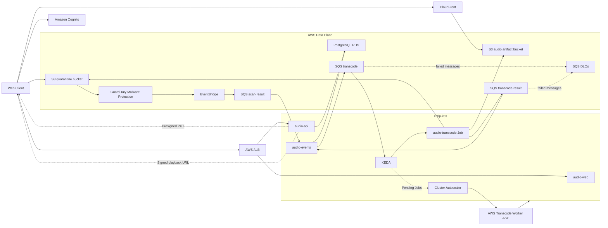
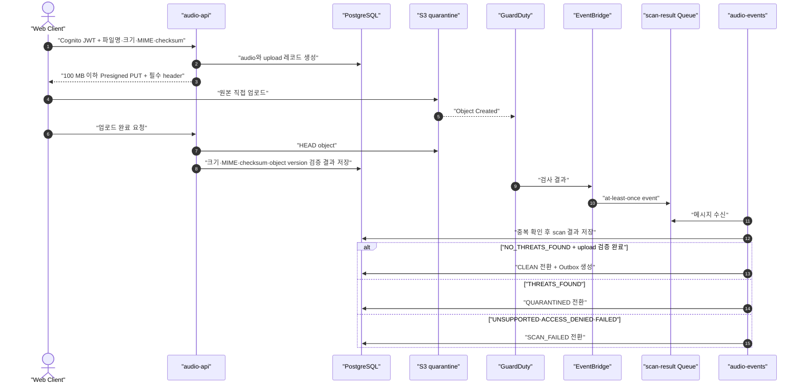
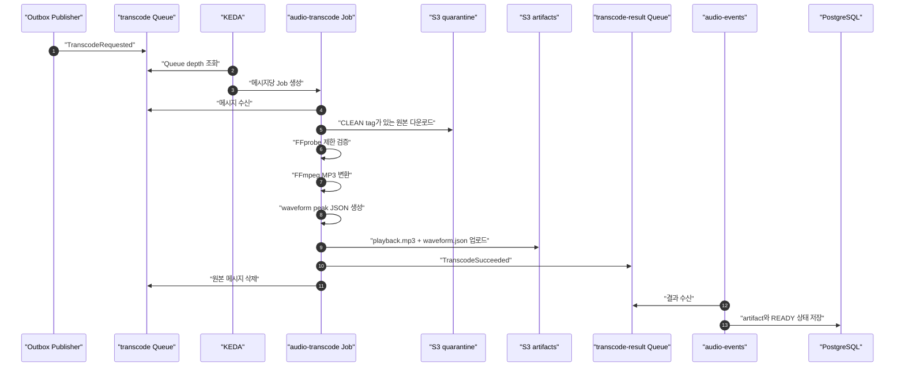
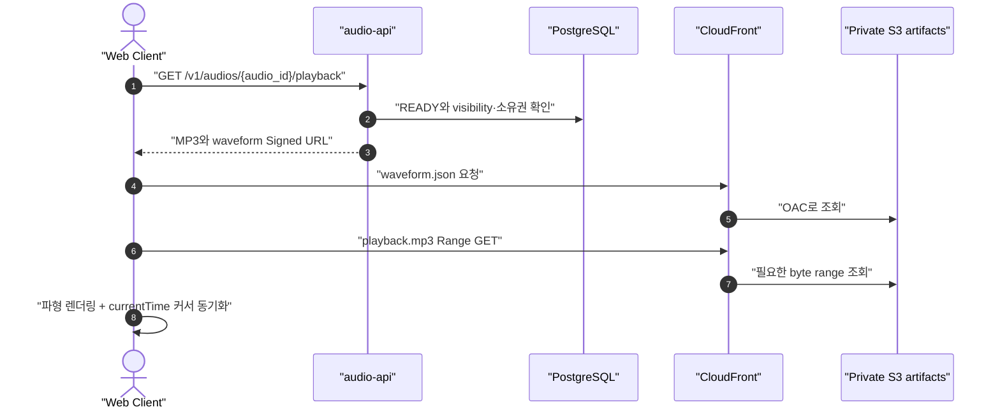
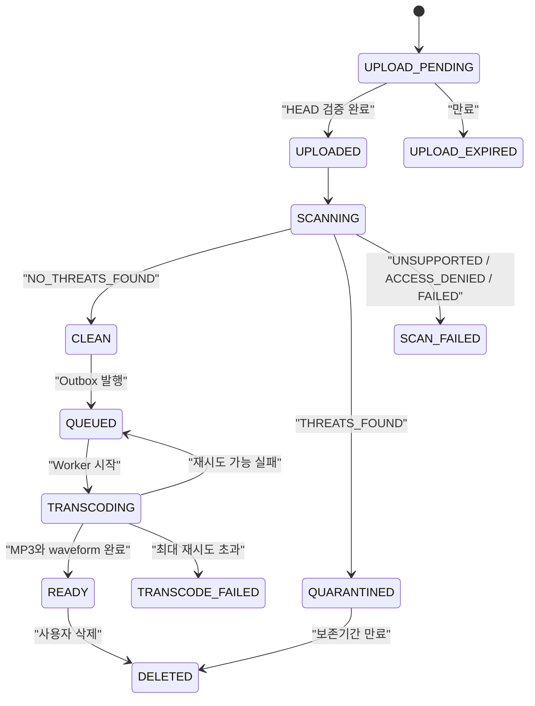

# Audio Service Architecture

## 1. 문서 상태

- 상태: MVP 구현 기준
- 대상: Cantaloupe 오디오 업로드·검사·변환·재생 서비스
- 애플리케이션 저장소: `03-app-audio`
- Kubernetes 매니페스트 저장소: `02-k8s-manifests`
- 인프라 저장소: `01-infra-provisioning`

이 문서는 `03-app-audio` 구현 코드보다 먼저 서비스 경계, 데이터 흐름, 실패 처리와 선택 근거를
고정한다. 세부 라이브러리 버전과 조정 가능한 용량 값은 각 구현 저장소에서
관리한다.

## 2. 목표와 비목표

### 목표

- 사용자가 웹에서 오디오를 업로드하고 처리 상태를 확인한다.
- 악성코드 검사를 통과한 파일만 FFmpeg 처리와 재생에 사용한다.
- 브라우저가 MP3를 seek하며 재생하고, 미리 생성된 파형 위에 현재 위치를 표시한다.
- DB 상태 변경과 Queue 메시지 발행 사이의 유실을 방지한다.
- 중복 메시지와 Worker 재시작에도 같은 작업을 안전하게 재실행한다.
- SQS 적체량에 따라 Pod를 확장하고, 검증 후 AWS Worker Node도 확장한다.
- 부하와 비용을 함께 측정할 수 있는 관측 지점을 둔다.

### MVP 비목표

- 라이브 방송과 실시간 녹음
- HLS Adaptive Bitrate Streaming
- 댓글, 좋아요, 팔로우, 추천 피드
- DRM과 광고 삽입
- GCP·On-Prem Node에서 사용자 오디오 처리

HLS는 MP3 기준선의 재생 품질과 비용을 측정한 뒤 비교 실험으로 추가한다.

## 3. 확정한 선택

| 영역 | 선택 | 이유 |
| --- | --- | --- |
| 개발 범위 | 핵심 오디오 MVP | 비동기 처리와 장애 복구를 먼저 검증한다. |
| API | Go | 작은 메모리 사용량과 명확한 동시성·타임아웃 제어를 우선한다. |
| Worker | Python + FFmpeg | 미디어 처리 도구 연동과 실험 속도를 우선한다. |
| Queue | SQS Standard + DLQ | Queue 서버를 클러스터에서 운영하지 않고 at-least-once 전달을 멱등 처리로 흡수한다. |
| 악성코드 검사 | GuardDuty Malware Protection for S3 | ClamAV 메모리와 시그니처 운영 부담을 AWS 관리형 검사로 대체한다. |
| 재생 | Progressive MP3 | VOD 오디오에 HLS playlist·segment 복잡도를 추가하지 않고 Range GET으로 seek한다. |
| 파형 | 사전 생성한 JSON | 재생 시 원본을 다시 분석하지 않고 브라우저에는 작은 peak 데이터만 전달한다. |
| 인증 | Cognito | 비밀번호를 애플리케이션 DB에서 관리하지 않고 JWT subject를 소유자 식별자로 쓴다. |
| 업로드 | 최대 100 MB 단일 Presigned PUT | Multipart 수명주기보다 MVP 단순성을 우선한다. |
| 확장 | KEDA + AWS ASG | SQS 적체로 Pod를 늘리고 Pending Pod가 생길 때 Node를 추가한다. |
| Kubernetes 범위 | `apps` Namespace + `audio-*` Workload | Namespace는 운영 영역, 이름과 라벨은 오디오 애플리케이션을 구분한다. |

## 4. 배치 원칙

- Kubernetes 클러스터는 하나다.
- 사용자 서비스는 AWS에서만 실행한다.
- GCP·On-Prem Node는 FinOps·DevOps·관측 용도이며 오디오 요청을 처리하지 않는다.
- 애플리케이션 Workload 이름에는 `cntlp`나 `aws`를 넣지 않는다.
- 실행 위치는 Node selector로 결정한다.

사용자 서비스는 `apps` Namespace에 배포한다.
`02-k8s-manifests/apps/audio/`는 Git 저장소의 영역·애플리케이션 디렉터리이며,
`audio`라는 별도 Namespace를 뜻하지 않는다. 오디오 도메인은 `audio-*` Workload
이름과 `app` 라벨로 구분한다.

```yaml
metadata:
  namespace: apps
  labels:
    app: audio-api
    area: apps
    platform: aws
spec:
  nodeSelector:
    platform: aws
    role: service
```

| Workload | 형태 | 책임 |
| --- | --- | --- |
| `audio-web` | Deployment | 업로드·상태·재생 UI |
| `audio-api` | Deployment | HTTP API, Cognito JWT 검증, Presigned URL과 재생 URL 발급 |
| `audio-events` | Deployment | Scan 결과·Worker 결과 소비, Outbox 발행 |
| `audio-transcode` | KEDA ScaledJob | 한 Job에서 SQS 메시지 한 건을 처리 |

Control Plane에는 사용자 Workload를 배치하지 않는다.

## 5. 전체 구조



CloudFront는 S3 Origin Access Control로 artifact bucket만 읽는다. S3의 직접
Public Access는 차단한다.

## 6. 업로드와 검사 흐름



GuardDuty 결과와 업로드 완료 요청은 순서가 뒤바뀔 수 있다. DB에는
`upload_verified`와 `scan_status`를 따로 저장하고 두 조건이 모두 충족됐을 때만
트랜스코딩을 요청한다.

### 업로드 검증

- Presigned URL 만료시간은 짧게 유지한다.
- 객체 key는 서버가 생성하며 사용자가 지정하지 않는다.
- `Content-Type`과 Base64로 인코딩한 `x-amz-checksum-sha256` header를 서명
  조건에 포함한다.
- 완료 요청에서 S3 `HEAD` 결과를 다시 검사한다.
- 최대 크기 초과, checksum 불일치, 허용하지 않은 MIME은 삭제 대상으로 표시한다.
- Presigned PUT은 동일 key를 덮어쓸 수 있으므로 upload ID를 포함한 불변 key와
  S3 Versioning을 사용한다.

클라이언트가 전달한 확장자와 MIME만으로 파일 형식을 신뢰하지 않는다. Worker는
FFprobe로 실제 미디어 형식과 duration을 확인한다.

## 7. 트랜스코딩과 파형 생성



MVP 기본 출력은 다음과 같다.

| Artifact | 기본값 | 용도 |
| --- | --- | --- |
| `playback.mp3` | stereo, 192 kbps | 브라우저 재생 |
| `waveform.json` | mono, 8-bit min/max peaks | 전체 파형 렌더링 |

구체적인 bitrate와 peak 해상도는 부하·품질 실험 결과로 변경할 수 있다.

### 파형 처리

파형은 재생 중 생성하지 않는다. Worker가 전체 오디오의 일정 구간별 min/max
amplitude를 미리 계산한다.

```json
{
  "schema_version": 1,
  "duration_ms": 185430,
  "points_per_second": 20,
  "bits": 8,
  "channels": 1,
  "peaks": [[-2, 3], [-5, 8], [-12, 15]]
}
```

브라우저는 JSON을 한 번 받아 Canvas나 SVG로 렌더링하고
`HTMLMediaElement.currentTime / duration` 비율로 재생 커서를 이동한다.
파형을 클릭하면 같은 비율로 `currentTime`을 변경한다.

JSON은 원본 PCM sample을 저장하지 않는다. 초당 peak 수와 전체 peak 개수를
제한하고 CloudFront 압축을 사용한다. 확대 편집 기능이 필요해질 때만
다중 해상도 또는 binary waveform을 추가한다.

## 8. 재생 흐름



- 업로드와 내부 S3 작업에는 Presigned S3 URL을 사용한다.
- 사용자 재생에는 CloudFront URL을 사용한다.
- 공개 오디오도 API가 visibility를 확인한 후 짧은 URL을 발급할 수 있다.
- 비공개 오디오는 Cognito 사용자와 owner를 확인한다.
- 원본 파일은 어떤 visibility에서도 재생 URL을 발급하지 않는다.

MVP에서는 MP3 한 객체에 대한 Range GET으로 seek한다. HLS는 실제 측정에서
Adaptive Bitrate, 라이브 스트리밍 또는 복구성이 필요하다고 확인될 때 도입한다.

## 9. 상태 모델



보안 검사 실패는 fail-open하지 않는다. `UNSUPPORTED`, `ACCESS_DENIED`,
`FAILED`도 CLEAN으로 간주하지 않는다.

MP3 생성은 성공했지만 waveform만 실패한 경우 같은 Job을 재시도한다. 최대
재시도 후에는 MP3를 보존하되 `TRANSCODE_FAILED`로 두고 운영자가 재처리할 수
있게 한다. MVP에서 불완전한 artifact를 `READY`로 공개하지 않는다.

## 10. API 경계

| Method | Path | 인증 | 책임 |
| --- | --- | --- | --- |
| `POST` | `/v1/audios/uploads` | Cognito JWT | audio ID와 Presigned PUT 생성 |
| `POST` | `/v1/audios/{audio_id}/complete` | Cognito JWT | S3 객체 검증 완료 기록 |
| `GET` | `/v1/audios/{audio_id}` | visibility에 따라 선택 | 메타데이터와 처리 상태 조회 |
| `GET` | `/v1/audios/{audio_id}/playback` | visibility에 따라 선택 | MP3·waveform CloudFront URL 발급 |
| `PATCH` | `/v1/audios/{audio_id}/visibility` | owner JWT | 공개 범위 변경 |
| `DELETE` | `/v1/audios/{audio_id}` | owner JWT | 논리 삭제와 객체 정리 요청 |

`audio-api`만 PostgreSQL의 애플리케이션 테이블을 직접 소유한다.
`audio-events`는 같은 Go 애플리케이션의 별도 실행 모드로 DB 트랜잭션을 사용한다.
Python Worker는 RDS에 연결하지 않고 S3와 SQS만 사용한다.

## 11. 데이터 모델

### `audios`

| 필드 | 의미 |
| --- | --- |
| `id` | 서버가 발급한 audio ID |
| `owner_subject` | Cognito `sub` |
| `title` | 사용자 표시 제목 |
| `visibility` | `public` 또는 `private` |
| `status` | 오디오 전체 상태 |
| `upload_id` | 업로드 재사용 방지 ID |
| `source_bucket`, `source_key`, `source_version` | 원본 위치 |
| `source_checksum`, `source_size`, `source_mime` | 검증 정보 |
| `scan_status` | GuardDuty 결과 |
| `duration_ms` | FFprobe 결과 |
| `playback_key`, `waveform_key` | artifact 위치 |
| `created_at`, `updated_at`, `deleted_at` | 수명주기 |

### `transcode_jobs`

| 필드 | 의미 |
| --- | --- |
| `id` | 전역 고유 job ID |
| `audio_id` | 대상 오디오 |
| `status` | `QUEUED`, `RUNNING`, `SUCCEEDED`, `FAILED` |
| `target_spec` | MP3와 waveform 생성 규격 |
| `attempt_count` | 애플리케이션 재시도 횟수 |
| `error_code` | 제한된 오류 분류 |
| `started_at`, `finished_at` | 처리 시간 |

### `outbox_events`

| 필드 | 의미 |
| --- | --- |
| `id` | event ID |
| `aggregate_id` | audio 또는 job ID |
| `event_type` | `TranscodeRequested` 등 |
| `schema_version` | 메시지 계약 버전 |
| `payload` | Queue에 보낼 작은 JSON |
| `created_at`, `published_at` | 발행 상태 |

### `processed_events`

`audio-events`가 이미 처리한 EventBridge·SQS event ID를 기록한다. 같은 이벤트가
재전달되면 DB 상태를 다시 변경하지 않는다.

## 12. Queue와 메시지 계약

| Queue | Producer | Consumer | DLQ |
| --- | --- | --- | --- |
| `scan-result` | EventBridge | `audio-events` | `scan-result-dlq` |
| `transcode` | Outbox Publisher | `audio-transcode` | `transcode-dlq` |
| `transcode-result` | `audio-transcode` | `audio-events` | `transcode-result-dlq` |

클라우드 자원 이름 예시는 다음 패턴을 따른다.

```text
cntlp-aws-queue-scan-result
cntlp-aws-queue-scan-result-dlq
cntlp-aws-queue-transcode
cntlp-aws-queue-transcode-dlq
cntlp-aws-queue-transcode-result
cntlp-aws-queue-transcode-result-dlq
```

`shared/schema/transcode-job.json`의 목표 필드는 다음과 같다.

```json
{
  "schema_version": 1,
  "event_id": "uuid",
  "job_id": "uuid",
  "audio_id": "uuid",
  "source": {
    "bucket": "cntlp-aws-quarantine",
    "key": "incoming/...",
    "version_id": "...",
    "checksum_sha256": "..."
  },
  "targets": {
    "mp3_bitrate_kbps": 192,
    "waveform_points_per_second": 20
  }
}
```

Queue에는 오디오 binary, 사용자 개인정보, Presigned URL과 AWS 자격 증명을 넣지
않는다.

### 전달 보장과 멱등성

- SQS Standard의 중복과 순서 변경을 정상 상황으로 취급한다.
- `(job_id, schema_version)`은 DB에서 유일해야 한다.
- artifact key는 job ID로 결정해 재실행 결과가 같은 위치에 기록되게 한다.
- Worker는 성공 결과 메시지를 보낸 뒤 원본 작업 메시지를 삭제한다.
- 결과 전송 후 삭제 전에 Worker가 죽어도 재실행이 안전해야 한다.
- 처리 시간이 길면 Worker가 SQS visibility timeout을 연장한다.
- DLQ redrive는 자동 무한 반복하지 않고 오류 원인을 확인한 뒤 수행한다.

## 13. DB와 Queue 일관성

API 요청에서 DB를 갱신한 직후 Queue 전송이 실패하면 상태와 메시지가 어긋난다.
이를 막기 위해 같은 PostgreSQL 트랜잭션에서 상태 변경과 Outbox row 생성을 함께
커밋한다.

```text
BEGIN
  audio 상태 CLEAN → QUEUED
  transcode_job 생성
  outbox_event 생성
COMMIT

Outbox Publisher
  → SQS 전송
  → published_at 기록
```

SQS 전송 성공 후 `published_at` 기록 전에 프로세스가 종료되면 메시지가 중복
발행될 수 있다. Worker의 job ID 멱등성이 이를 흡수한다.

## 14. S3 구조와 접근 제어

### Bucket

| 이름 예시 | 내용 | 사용자 직접 읽기 |
| --- | --- | --- |
| `cntlp-aws-quarantine` | 업로드 원본과 격리 대상 | 금지 |
| `cntlp-aws-transcode` | MP3와 waveform artifact | CloudFront를 통해서만 허용 |

```text
cntlp-aws-quarantine/
└─ incoming/{audio_id}/{upload_id}/source

cntlp-aws-transcode/
└─ audios/{audio_id}/artifacts/{job_id}/
   ├─ playback.mp3
   └─ waveform.json
```

### 정책

- S3 Block Public Access를 켠다.
- Bucket owner enforced를 사용하고 ACL을 사용하지 않는다.
- 기본 암호화를 켠다.
- GuardDuty post-scan object tagging을 켠다.
- CloudFront는 OAC를 통해 artifact bucket의 `GetObject`만 허용한다.
- Transcode Worker는 GuardDuty 결과 tag가 `NO_THREATS_FOUND`인 원본만 읽는다.
- 감염 원본과 완료되지 않은 업로드에는 Lifecycle 보존기간을 적용한다.
- 원본과 artifact 삭제는 DB 논리 삭제 후 비동기 정리로 처리한다.

## 15. 인증과 AWS 권한

### 사용자 인증

- Web은 Cognito Authorization Code + PKCE 흐름을 사용한다.
- API는 Cognito JWKS로 JWT 서명을 검증한다.
- `sub`, `iss`, `aud` 또는 `client_id`, 만료시간을 확인한다.
- 이메일을 DB의 불변 소유자 키로 사용하지 않는다.

### Workload 권한

장기 IAM access key를 Kubernetes Secret, Git, Terraform 변수에 저장하지 않는다.
목표 구조는 self-managed Kubernetes ServiceAccount와 AWS IAM OIDC federation을
연결해 임시 자격 증명을 발급하는 것이다.

| ServiceAccount | 최소 권한 |
| --- | --- |
| `audio-api` | Presigned PUT, CloudFront 서명키 조회, 필요한 Secret 조회 |
| `audio-events` | 세 Queue consume/publish, 필요한 Secret 조회 |
| `audio-transcode` | CLEAN 원본 읽기, artifact 쓰기, 작업·결과 Queue 접근 |
| `keda-operator` | SQS queue attribute 조회 |
| `cluster-autoscaler` | 대상 ASG 조회·용량 변경·인스턴스 종료 |

OIDC federation 도입 전 임시로 EC2 instance profile을 사용한다면 Workload를
전용 AWS Node에 고정하고 역할을 최소화한다. 정적 IAM user key는 대안으로
허용하지 않는다.

RDS 비밀번호와 CloudFront private signing key의 원본은 Secrets Manager에 두고,
Git과 매니페스트에는 넣지 않는다.

### Worker 실행 격리

GuardDuty가 악성코드를 찾지 못했다는 결과가 미디어 decoder 취약점까지 없다는
뜻은 아니다. FFmpeg Worker는 다음 제한을 적용한다.

- non-root 사용자로 실행
- `allowPrivilegeEscalation: false`
- `readOnlyRootFilesystem: true`
- Linux capability 전체 제거
- `seccompProfile: RuntimeDefault`
- ServiceAccount token 자동 mount 비활성화
- CPU·메모리·ephemeral storage 제한
- 입력·출력 경로 외 hostPath와 host network 사용 금지

## 16. 자동 확장

선택한 최종 목표는 Pod와 Node를 모두 확장하는 것이다. 안전한 검증을 위해 세
단계로 나눈다.

### 단계 1: 정적 Worker에서 기능 검증

- 기존 AWS Worker를 사용한다.
- `audio-transcode` 동시 처리 수는 1이다.
- 파일 최대 크기는 100 MB다.
- CPU·메모리 request와 limit, 임시 디스크 limit을 측정한다.

### 단계 2: KEDA ScaledJob

- SQS `transcode` 적체량으로 Job 수를 결정한다.
- Job 하나가 메시지 하나를 처리하고 종료한다.
- `minReplicaCount=0`으로 유휴 Pod 비용을 줄인다.
- `maxReplicaCount`는 예산과 Node 상한을 함께 고려해 제한한다.
- Queue visible 메시지와 in-flight 메시지를 구분해 과도한 확장을 막는다.

### 단계 3: AWS Worker ASG

- Transcode 전용 Launch Template과 ASG를 만든다.
- Cluster Autoscaler가 Pending `audio-transcode` Pod를 보고 ASG desired
  capacity를 변경한다.
- 초기 비용 상한은 ASG `min=0`, `max=3`으로 둔다.
- scale-from-zero가 가능하도록 ASG에 다음 Node template label을 선언한다.

```text
k8s.io/cluster-autoscaler/enabled
k8s.io/cluster-autoscaler/cntlp-k8s
k8s.io/cluster-autoscaler/node-template/label/platform=aws
k8s.io/cluster-autoscaler/node-template/label/role=service
```

실제 Node bootstrap도 같은 `platform=aws`, `role=service` 라벨을 적용해야 한다.

### Node bootstrap 전제

ASG를 활성화하기 전에 다음 자동화가 검증되어야 한다.

1. Ansible 역할을 사용해 Packer로 Worker AMI 생성
2. 부팅 시 IMDSv2 instance profile로 필요한 bootstrap secret만 조회
3. Tailscale에 `tag:cntlp-wk`로 가입
4. Tailscale IPv4를 kubelet `--node-ip`로 지정
5. 회전 가능한 kubeadm join credential로 `cntlp-k8s` 가입
6. Node Ready와 Calico 준비 상태 확인
7. 종료 시 Pod drain, Kubernetes Node와 Tailscale device 정리

이 절차가 없으면 ASG는 EC2만 늘리고 Kubernetes Worker를 만들지 못한다.
따라서 단계 3은 별도 인프라 승인과 장애 복구 시험 후 활성화한다.

## 17. 실패 처리

| 실패 | 처리 | 사용자 상태 |
| --- | --- | --- |
| Presigned URL 만료 | 새 upload ID 발급 | `UPLOAD_PENDING` |
| 업로드 크기·checksum 불일치 | 객체 삭제 대상으로 표시 | `UPLOAD_FAILED` |
| GuardDuty 위협 발견 | 트랜스코딩 금지, 격리 보존 | `QUARANTINED` |
| GuardDuty 검사 불가 | 자동 통과 금지, 운영 확인 | `SCAN_FAILED` |
| SQS 중복 메시지 | event ID·job ID로 무시 또는 안전 재실행 | 기존 상태 유지 |
| Worker Pod 종료 | visibility timeout 후 재전달 | `QUEUED` 또는 `TRANSCODING` |
| FFmpeg 제한 위반 | 비재시도 오류로 DLQ | `TRANSCODE_FAILED` |
| 일시적 S3·SQS 오류 | 지수 backoff 후 제한 재시도 | 처리 중 |
| 결과 메시지 유실 | Worker가 작업 메시지를 삭제하지 않아 재실행 | 처리 중 |
| DLQ 적체 | 경보 후 원인 확인·수동 redrive | 실패 상태 |
| Node 부족 | KEDA Job Pending, Cluster Autoscaler 확장 | `QUEUED` |
| 예산 상한 도달 | KEDA pause 또는 maxReplica 축소 | `QUEUED` |

FFmpeg와 FFprobe에는 실행 시간, CPU, 메모리, 임시 디스크, 출력 크기 제한을 둔다.
사용자가 올린 파일 이름을 shell command에 직접 보간하지 않고 argv로 전달한다.

## 18. 관측성과 FinOps

### Metrics

- API 요청 수·오류율·latency
- upload 완료율과 크기 histogram
- scan 결과별 개수
- SQS visible·in-flight·oldest message age
- transcode queue time·processing time·success·failure
- Worker CPU·메모리·임시 디스크
- KEDA desired Job 수와 실제 Job 수
- ASG Node 수와 scale event
- MP3 byte 전송량과 CloudFront cache hit ratio
- S3 저장량·GET·PUT 요청 수
- 오디오 1건당 처리 시간과 추정 비용

`audio_id`, `job_id`, `user_id`는 로그와 trace field에는 사용할 수 있지만
Prometheus label이나 Kubernetes label에는 사용하지 않는다.

### 로그와 추적

- 로그는 JSON 구조로 남긴다.
- event ID, audio ID, job ID를 correlation field로 사용한다.
- Presigned URL, JWT, CloudFront signature, AWS credential은 로그에 남기지 않는다.
- API → Outbox → SQS → Worker → Result 흐름의 시간 구간을 분리해 측정한다.

## 19. 비용 경계

- GuardDuty Malware Protection for S3 Free Tier를 넘는 객체 수와 scan byte를
  Budget 경보에 포함한다.
- 원본은 재처리 정책에 필요한 기간만 보존하고 Lifecycle로 전환·삭제한다.
- artifact는 MP3 한 rendition과 waveform 하나로 시작한다.
- HLS segment와 320 kbps 추가 rendition은 측정 근거 없이 생성하지 않는다.
- KEDA와 ASG의 최대 동시 처리 수를 함께 제한한다.
- Worker scale-from-zero를 사용하되 Node bootstrap 실패가 반복되면 자동 확장을
  정지한다.
- DLQ 메시지는 비용과 장애 신호이므로 오래 방치하지 않는다.
- CloudFront와 S3 request·transfer 비용을 MP3 기준선으로 기록한다.

## 20. 저장소별 구현 경계

### `00-cantaloupe-resources`

- 프로젝트 공통 명명·라벨 규칙
- 여러 저장소에 공통으로 적용되는 보안·비용·운영 정책

### `01-infra-provisioning`

- S3, SQS, DLQ, EventBridge, GuardDuty, Cognito, CloudFront, IAM, ASG
- Packer·Ansible Worker image와 bootstrap
- Terraform 비용 상한과 destroy 경계

### `02-k8s-manifests`

- `apps` Namespace의 Deployment·Service·KEDA ScaledJob
- AWS Node selector
- resource request·limit
- NetworkPolicy, PodDisruptionBudget, Secret 참조
- Cluster Autoscaler와 KEDA 배포 설정

매니페스트는 GitOps 저장소를 통해 배포하고 수동 `kubectl apply`를 기준 절차로
사용하지 않는다.

### `03-app-audio`

- 이 서비스 아키텍처와 변경 이유
- API·Queue 메시지 계약
- Go `audio-api`와 `audio-events`
- Python `audio-transcode`
- Web UI
- DB migration
- `shared/schema`의 Queue JSON Schema
- 단위·통합·FFmpeg fixture 테스트

API와 Worker 메시지 Schema는 같은 커밋에서 호환되게 변경한다.

## 21. 단계별 구현

### Phase 1: 계약과 로컬 수직 흐름

1. `transcode-job.json`에 schema version과 job ID 추가
2. PostgreSQL migration 작성
3. Go upload·complete·status API 작성
4. Python MP3·waveform Worker 작성
5. Local PostgreSQL·S3·SQS 대체 환경에서 한 건 처리
6. 중복 메시지와 Worker 강제 종료 시험

### Phase 2: AWS 관리형 자원 연결

1. Private S3와 Lifecycle
2. GuardDuty Malware Protection과 EventBridge
3. SQS 세트와 DLQ
4. Cognito
5. CloudFront OAC와 Signed URL
6. Private RDS와 migration

### Phase 3: Kubernetes 배포

1. `audio-web`, `audio-api`, `audio-events` 배포
2. AWS Node selector와 resource limit 적용
3. NetworkPolicy와 Secret 연동
4. KEDA ScaledJob 적용
5. 실제 SQS·S3·RDS 통합 검증

### Phase 4: Node 자동 확장

1. Packer Worker AMI와 bootstrap 검증
2. ASG를 `min=0`, `max=1`로 시작
3. scale-from-zero와 Node Ready 검증
4. 처리 중 scale-down·재시도 검증
5. 예산 승인 후 `max=3`까지 확대

### Phase 5: 부하·FinOps 실험

1. MP3 기준선 측정
2. Queue 적체와 KEDA 확장 시험
3. Worker 장애·DLQ·복구 시험
4. On-Demand와 Spot 비교
5. 필요할 때만 HLS 비교 구현

## 22. 완료 기준

- 브라우저가 AWS credential 없이 100 MB 이하 오디오를 직접 업로드한다.
- 악성코드 검사 완료 전에는 Worker와 사용자가 원본을 읽지 못한다.
- 위협·검사 실패 파일이 재생 가능한 상태로 전환되지 않는다.
- 같은 SQS 메시지를 두 번 처리해도 DB와 artifact가 중복 생성되지 않는다.
- Worker가 중간에 종료되어도 메시지가 다시 처리된다.
- MP3 Range GET seek와 waveform click seek가 동작한다.
- API와 Worker는 GCP·On-Prem Node에 배치되지 않는다.
- Queue가 비면 Transcode Job은 0개가 된다.
- ASG 활성화 후 Pending Job이 AWS Worker Node를 만들고 완료 후 축소된다.
- 파일 1건 기준 처리 시간·오류·AWS 사용량을 관측할 수 있다.
- 모든 Secret과 장기 credential이 Git·이미지·Queue·로그에 없다.

## 23. 선택하지 않은 대안

### 오디오 binary를 PostgreSQL에 저장

DB 백업, I/O, 용량과 네트워크 비용을 키우므로 선택하지 않는다. DB에는
메타데이터와 상태만 저장한다.

### API를 통한 multipart binary 업로드

API Pod의 메모리·네트워크를 파일 전달에 사용하고 확장 병목을 만들므로 선택하지
않는다. Client가 S3에 직접 업로드한다.

### Redis·NATS를 클러스터에서 운영

현재 목표에는 SQS가 제공하는 Queue와 DLQ로 충분하다. 메시징 서버의 메모리,
볼륨, 백업과 장애 복구를 추가하지 않는다.

### ClamAV Pod

악성코드 엔진과 signature 갱신을 직접 운영하고 현재 AWS Worker 자원을
소비하므로 MVP에서 제외한다. GuardDuty와 ClamAV 비교는 별도 실험으로 남긴다.

### HLS

VOD 오디오 한 rendition에는 playlist·segment·인증·CORS·요청 수 증가가 이점보다
크다. Progressive MP3와 Range GET을 기준선으로 삼고 Adaptive Bitrate나 라이브
요구가 확인될 때 도입한다.

### Worker의 RDS 직접 연결

Worker가 DB credential과 schema에 결합되고 Node가 늘어날수록 DB 접근 경계가
넓어진다. Worker는 결과 Queue만 발행하고 `audio-events`가 DB를 갱신한다.

## 24. 참고 문서

- [Amazon S3 Presigned URL](https://docs.aws.amazon.com/AmazonS3/latest/userguide/using-presigned-url.html)
- [GuardDuty Malware Protection for S3 동작](https://docs.aws.amazon.com/guardduty/latest/ug/how-malware-protection-for-s3-gdu-works.html)
- [GuardDuty Malware Protection for S3 비용](https://docs.aws.amazon.com/guardduty/latest/ug/pricing-malware-protection-for-s3-guardduty.html)
- [Amazon SQS 선택 가이드](https://docs.aws.amazon.com/pdfs/decision-guides/latest/sns-or-sqs-or-eventbridge/sns-or-sqs-or-eventbridge.pdf)
- [CloudFront Range GET](https://docs.aws.amazon.com/AmazonCloudFront/latest/DeveloperGuide/RangeGETs.html)
- [CloudFront S3 OAC](https://docs.aws.amazon.com/AmazonCloudFront/latest/DeveloperGuide/private-content-restricting-access-to-s3.html)
- [KEDA SQS Scaler](https://keda.sh/docs/2.20/scalers/aws-sqs/)
- [KEDA ScaledJob](https://keda.sh/docs/2.20/concepts/scaling-jobs/)
- [Kubernetes Node Autoscaling](https://kubernetes.io/docs/concepts/cluster-administration/node-autoscaling/)
- [Cluster Autoscaler on AWS](https://github.com/kubernetes/autoscaler/blob/master/cluster-autoscaler/cloudprovider/aws/README.md)
- [BBC audiowaveform](https://github.com/bbc/audiowaveform)
- [Web MP3 codec compatibility](https://developer.mozilla.org/en-US/docs/Web/Media/Guides/Formats/Audio_codecs)
